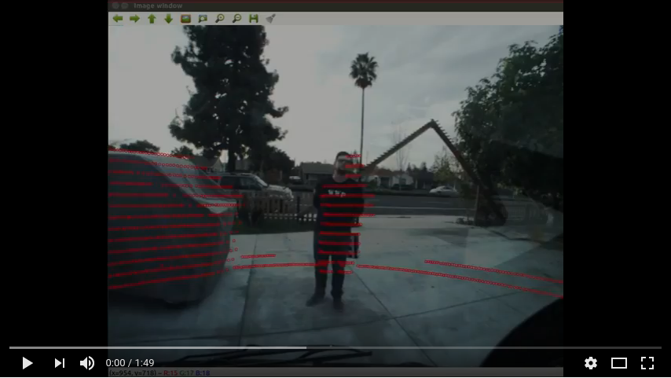

[](https://youtu.be/fG1fqfM8xJo)


# A project to demonstrate the following  

* Camera Calibration  
* Camera -- LiDAR cross calibration (W.I.P)    
* Visualization of RGB data in point cloud (W.I.P)    

---
This project was tested on Ubuntu 16.04 and ROS Kinetic
Clone the repo, download the rosbag from [here](https://drive.google.com/open?id=16PdqoSVnvelMBUb1EpImWJoqm6Q9HX4N) and follow the instructions below to run it.

> You have to edit the location of the rosbag; pointing to wherever it is on your system, in the `lidar_composite.launch` file inside the `lidar-calib` package

# Run

```
cd lidar-camera-calib/
catkin_make
source devel/setup.bash
roslaunch lidar_calib lidar_composite.launch

```

You should see an image window pop-up showing the video of the LiDAR points projected on the image frame. 

You can also visualize the LiDAR and the composite lidar image data on rviz. 

A writeup of this project is located [here](documentation/docs/index.md)

I referred the following articles:
[Processing Camera Data](https://mirror.umd.edu/roswiki/attachments/Events(2f)PR2BetaTraining/camera_processing.pdf)  
[OpenCV Camera Calibration and 3D Reconstruction](https://docs.opencv.org/2.4/modules/calib3d/doc/camera_calibration_and_3d_reconstruction.html#void%20projectPoints(InputArray%20objectPoints,%20InputArray%20rvec,%20InputArray%20tvec,%20InputArray%20cameraMatrix,%20InputArray%20distCoeffs,%20OutputArray%20imagePoints,%20OutputArray%20jacobian,%20double%20aspectRatio))  
[Programming Computer Vision with Python](http://programmingcomputervision.com/)
