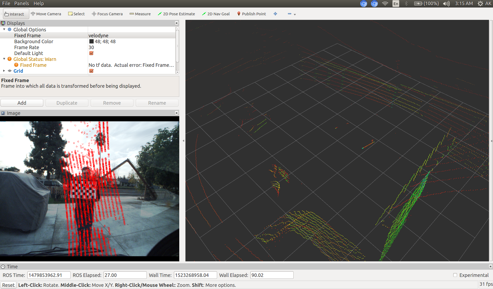
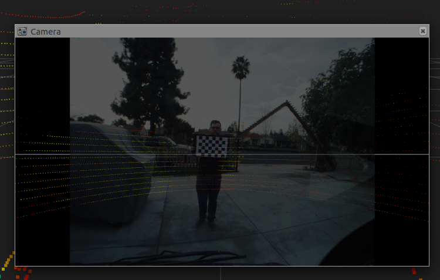
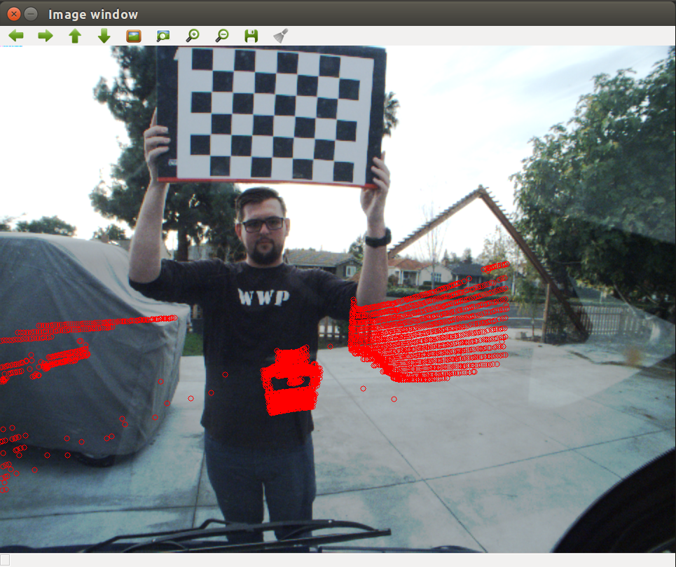

[](https://youtu.be/fG1fqfM8xJo)


# Documentation on the LiDAR-Camera Calibration

There are three tasks to be completed.  

* Monocular Camera Calibration  
* Camera -- LiDAR cross calibration  
* Visualization of data in point cloud  

---
## Task 1: Monocular Camera Calibration  
Perform Camera Calibration for the monocular camera data that is stored in the rosbag provided.  
The ROS wiki provides a good description on  [How to Calibrate a Monocular Camera](https://wiki.ros.org/camera_calibration/Tutorials/MonocularCalibration) .  
By running the `cameracalibrator.py` node in the terminal, I was able to get the calibration parameters saved in a yaml file. Before we get to that we must inspect the rosbag for the type of messages that we are to expect.

###### Run this in the terminal  
```
rosbag info 2016-11-22-14-32-13_test.bag
```


* I get the following output:

```
path:        2016-11-22-14-32-13_test.bag
version:     2.0
duration:    1:53s (113s)
start:       Nov 22 2016 14:32:14.41 (1479853934.41)
end:         Nov 22 2016 14:34:07.88 (1479854047.88)
size:        3.1 GB
messages:    5975
compression: none [1233/1233 chunks]
types:       sensor_msgs/CameraInfo  [c9a58c1b0b154e0e6da7578cb991d214]
             sensor_msgs/Image       [060021388200f6f0f447d0fcd9c64743]
             sensor_msgs/PointCloud2 [1158d486dd51d683ce2f1be655c3c181]
topics:      /sensors/camera/camera_info   2500 msgs    : sensor_msgs/CameraInfo 
             /sensors/camera/image_color   1206 msgs    : sensor_msgs/Image      
             /sensors/velodyne_points      2269 msgs    : sensor_msgs/PointCloud2
```


This rosbag data consists of the monocular camera data and velodyne lidar data. The concerned __topics__ for this task are `/sensors/camera/camera_info`  and  `/sensors/camera/image_color` .  

I played the rosbag data and used the `cameracalibrator.py` node to get a GUI that started performing the calibration as the camera data played. I calibrated and saved the parameters.


* The command to play the rosbag is:
```
$ rosbag play 2016-11-22-14-32-13_test.bag
```
  

* The command to run the `cameracalibrator.py` node is:
```
$ rosrun camera_calibration cameracalibrator.py --size=5x7 --square=0.050 image:=/sensors/camera/image_color camera:=/sensors/camera/camera_info  --no-service-check
```

> The checker board pattern had the dimensions 5x7 corners and each square was 5cm.


* The calibration parameters obtained by running the above command is as follows:
```
image_width: 964
image_height: 724
camera_name: narrow_stereo
camera_matrix:
  rows: 3
  cols: 3
  data: [484.093389, 0.000000, 456.852175, 0.000000, 483.969563, 365.996130, 0.000000, 0.000000, 1.000000]
distortion_model: plumb_bob
distortion_coefficients:
  rows: 1
  cols: 5
  data: [-0.198634, 0.067562, 0.003059, 0.000139, 0.000000]
rectification_matrix:
  rows: 3
  cols: 3
  data: [1.000000, 0.000000, 0.000000, 0.000000, 1.000000, 0.000000, 0.000000, 0.000000, 1.000000]
projection_matrix:
  rows: 3
  cols: 4
  data: [424.457428, 0.000000, 460.282975, 0.000000, 0.000000, 431.685059, 369.980132, 0.000000, 0.000000, 0.000000, 1.000000, 0.000000]
```


I wrote a C++ code to get the camera calibration parameters and used this [OpenCV documentation on Camera Calibration](https://docs.opencv.org/2.4/doc/tutorials/calib3d/camera_calibration/camera_calibration.html
) as a reference.

You can find this file under `src/cam_calib/src/images/camCalibrationParameters.cpp` . I screen-grabbed 30 images from the rosbag and used a yml file to read in the list of images for camera calibration process. 

> It is important to know that a `.jpg` image output will be different from a `.png` output while calibrating the camera. I realised this when I was working with `.png` files and the camera calibration paramenters always showed zeros.

I use the terminal to run my code and the command is:
```
$ g++ -std=c++11 camCalibrationParameters.cpp `pkg-config --libs --cflags opencv` -o output

$ ./output

```

The output of my code is stored in a yml file which is as follows:

```
%YAML:1.0
---
camera_matrix: !!opencv-matrix
   rows: 3
   cols: 3
   dt: d
   data: [ 4.8500013227778845e+02, 0., 4.6048439978206324e+02, 0.,
       4.8446529771202120e+02, 3.6882717135520573e+02, 0., 0., 1. ]
distortion_coefficients: !!opencv-matrix
   rows: 1
   cols: 5
   dt: d
   data: [ -2.1897207538791941e-01, 1.1378088445810178e-01,
       2.7963672438432903e-03, 1.2647206581812528e-03,
       -2.7036330701899484e-02 ]

```

##### TODO

- [ ] explain image_proc
- [ ] bag_tools used for recording new rosbag with camera calibration
- [ ] unavailability of bag_tools for ROS Kinetic
- [ ] rectified image output

The [rectified image output](../_videos/rectified_camera_output.mp4) video is placed inside the `_videos` directory.

## Task 2. Camera -- LiDAR Cross Calibration  

The quick method to check if there is a possibility to arrive at an answer.  
Publish a `static_transform` and use RVIZ's camera overlay option to find out this possibility.  

  

How to get this on rviz is by following:  

Terminal 1:

```
$ roscore
```
Terminal 2:

```
$ rosrun tf static_transform_publisher 1 0 0 1.5708 3.14159 1.5708 velodyne camera_optical 10
```

Terminal 3:

```
$ rosparam set use_sim_time true
$ rosrun rviz rviz
```

Terminal 4:

```
$ rosbag play -l yourBagFile.bag --clock
```


The task is to overlay the LiDAR data onto the camera display and visualize it in rviz.  

I thought about two apporaches for this task and chose the idea of triangulation technique.
We need a co-relation between the 3D point cloud and the 2D image coordinates. I split this task in two:

* Obtain the rotation and translation vectors between the LiDAR and the camera frames
* Use the calculated rotation and translation vectors to find the 3D  `projected_points` on the image and draw circles to indicate those projected points on the camera display

### Subtask 1. Rotation and Translation Vectors
I arbitraily chose six 2D co-ordinates from the image frame and the corresponding 3D co-ordinates from the point cloud using RVIZ's `Publish Point` option. These six points comprised of the four corners of the checkerboard and the midpoint of the sides that are parallel to the ground. By this way I get the first relation between the LiDAR and the camera data. Although the other approach (idea #2) was certainly robust, the current idea can lead you to a good answer faster. Let's think of it like a sanity check.  

In OpenCV there is a function called  [`cv::solvePnP`](https://docs.opencv.org/2.4/modules/calib3d/doc/camera_calibration_and_3d_reconstruction.html) that I used to calculate the rotation and the translation vectors. The six 2D co-ordinates and the 3D co-ordinates were hard-coded. As a definite improvement, instead of feeding an initial calues of all zeros for the rotation and translation vectors; a good estimation algorithm can be used to get a proper local minima that gives a relatively small error with the 3D projected points.  

To find the projected points and analyse the error, another OpenCV function `cv::projectpoints` was used.  The C++ code `solvePnP.cpp` can be found [here](../src/lidar_calib/src/solvePnP.cpp).  

### Subtask 2. Overlay the LiDAR data on the image topic (W.I.P)

This is a ROS node that subscribes to the following:

`/sensors/camera/image_rect_color`  
`/sensors/camera/camera_info`  
`/sensors/velodyne_points`

and publishes the composite image on `/sensors/camera/lidar_image`.  
The node subscibes to the LiDAR data from the modified rosbag and some processing is done on the `pcl::PointCloud2` data. The rosbag data format for the LiDAR is `sensor_msgs/PointCloud2`. I inspected the data using `rqt` another handy tool, and found that the data comprised of `pcl::PointXYZI` type. 3D co-ordinates X, Y, Z and the intensity I.  

Some processing is done on the PCL data to omit the negative x-axis values and to also limit the values in the positive x-axis between 0 and 4.5 meters away from the LiDAR. I did not do any downsampling as I felt the data was not that dense and can be managed easily.  

Later, the X, Y, Z points are fed into the OpenCV function `cv::projectpoints`. The camera calibration parameters - camera intrinsic matrix, distortion co-efficients matrix, rotation and translation vectors were also utilised from the previous tasks. 

Here is an image of a partial output for this task




A video of the partial output can be found [here](https://www.youtube.com/watch?v=30VkTsPEkds)

[`cv_bridge`](http://wiki.ros.org/cv_bridge/Tutorials/UsingCvBridgeToConvertBetweenROSImagesAndOpenCVImages) package was helpful in converting between ROS Image msg -> CV Image -> ROS Image msg.  

There are some more things necessary to finish this task. So far, the code compiles and data is printed on the modified composite camera image topic `/sensors/camera/lidar_image`, but apparently there is some error with the rotation vectors which makes the output not useful, when visualized through RVIZ. 

#### TODO 
- [ ] use image_transport::CameraSubscriber for time synchronization between the topics subscribed from the rosbag
- [ ] `cv::circle` populates and is retained longer which must be refreshed
- [ ] appropriate pre-processing of LiDAR data axes

The C++ ROS node can be found [here](../src/lidar_calib/src/lidar_Cam_Calibration.cpp).  

A [snapshot](../_results/task2output.png) of the progressive output of Task 2 can be found in the `_results` directory. 


Clearly, there is a huge error with the rotation vector values computed and the mismatch of frames between camera and the LiDAR.


## Task 3. Visualize RGB data from the camera as a point cloud in RVIZ

It is essentially the reverse process of projecting the 2D cordinates with RGB data on a 3D co-ordinate point cloud. By using the `pcl::PointXYZRGB` type the appropriate RGB values from every pixel in an image frame can be visualized in 3D.  

As this is a continuation of the previous task, the correct tranformation matrix and the frame matching is essential to achieve a decent/acceptable output. 


I referred the following articles:
[Processing Camera Data](https://mirror.umd.edu/roswiki/attachments/Events(2f)PR2BetaTraining/camera_processing.pdf)  
[OpenCV Camera Calibration and 3D Reconstruction](https://docs.opencv.org/2.4/modules/calib3d/doc/camera_calibration_and_3d_reconstruction.html#void%20projectPoints(InputArray%20objectPoints,%20InputArray%20rvec,%20InputArray%20tvec,%20InputArray%20cameraMatrix,%20InputArray%20distCoeffs,%20OutputArray%20imagePoints,%20OutputArray%20jacobian,%20double%20aspectRatio))  
[Programming Computer Vision with Python](http://programmingcomputervision.com/)
